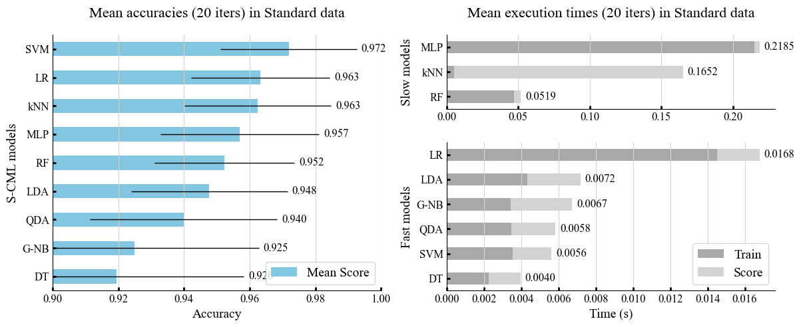
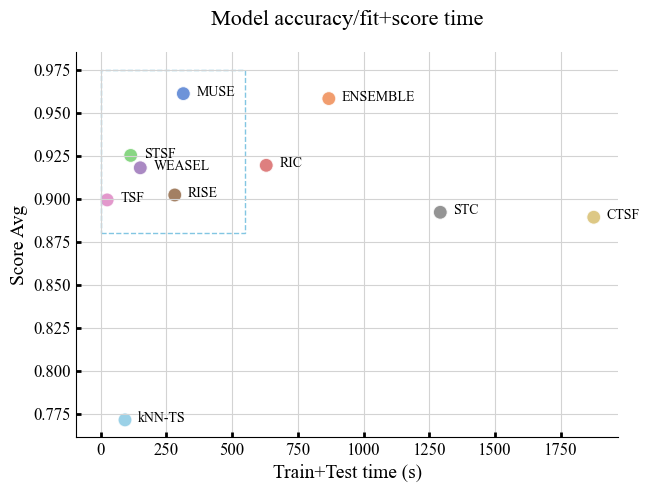
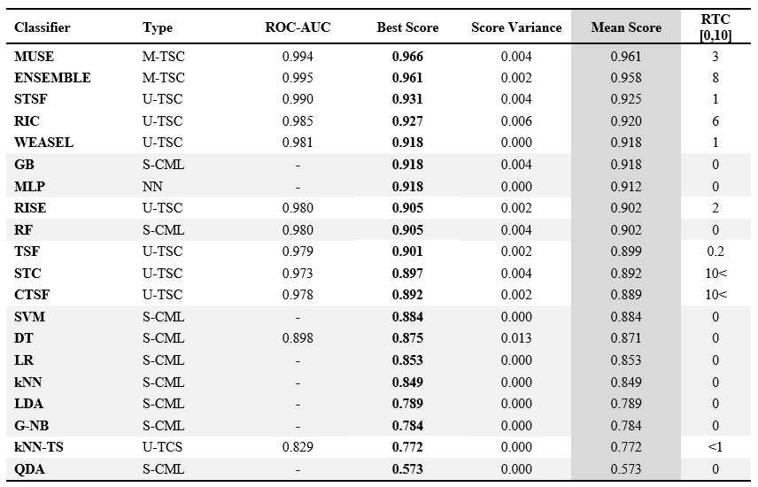

# Master Thesis Project

Sport Activity Classification Using Classical Machine Learning and Time Series Methods

## Python environment dependencies

### Python version 3.8.16

**channels:**
- defaults

**dependencies:**
- ipykernel
- pandas
- seaborn
- scikit-learn
- threadpoolctl
- python=3.8
- numpy
- jinja2
- sktime
- tqdm

## Testing environment

| Device | Lenovo Yoga 920-13IKB |
| --- | --- |
| Processor | Intel(R) Core(TM) i5-8250U CPU @ 1.60GHz (1.80 GHz) |
| Installed RAM | 8,00 GB |
| System type | 64-bit operating system, x64-based processor |

| Development environment | Visual Studio Code, Jupyter extension |
| --- | --- |
| Version | 1.74.3 (user setup) |
| Electron | 19.1.8 |
| Chromium | 102.0.5005.167 |
| Node.js | 16.14.2 |
| V8 | 10.2.154.15-electron.0 |
| OS | Windows_NT x64 10.0.22621 |
| Sandboxed |  No |

## Jupyter Notebooks with preview are available in Kaggle

* Part 1: https://www.kaggle.com/code/jarnomatarmaa/masterprojectcode-cml
* Part 2: https://www.kaggle.com/code/jarnomatarmaa/masterprojectcode-tsc
* Part 3: https://www.kaggle.com/code/jarnomatarmaa/masterprojectcode-sac-analysis

Unfortunately, GitHub does not support Jupyter Notebook preview

## Data collection method

## Study pipeline

## Adopted models

### Sklearn
- k-Nearest Neighbors (kNN)
- Gaussian Naive Bayes (G-NB)
- Quadratic Discriminant Analysis (QDA)
- Logistic Regression (LR)
- Support Vector Machine (SVM)
- Decision Tree (DT)
- Random Forest (RF)
- Multilayer Perceptron (MLP)
- Linear Discriminant Analysis (LDA)

### Sktime
- Time Series Forest Classifier (TSF)
- Supervised Time Series Forest (STSF)
- Random Interval Spectral Ensemble (RISE)
- Random Interval Classifier (RIC)
- Shapelet Transform Classifier (STC)
- KNeighbors Time Series Classifier (kNN-TS)
- Composable Time Series Forest Classifier (CTSF)
- WEASEL
- HIVE-COTEv1.0
- MUSE
- Column Ensemble (STSF-STSF-RIC)

## Main results of the study

### Standard Classical Machine Learning (S-CML)

### Univariate and Multivariate Time Series Classification (U-TSC and M-TSC)

## Result table (Compiled S-CML, U-TSC and M-TSC)

